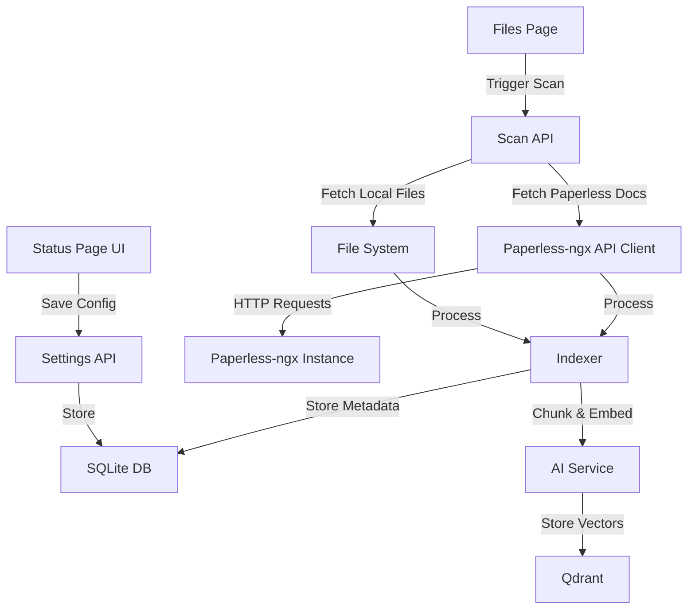

# Design Document: Paperless-ngx Integration

## Overview

This design document outlines the integration of Paperless-ngx document management system with the existing RAG application. The integration will treat Paperless-ngx as an additional document source alongside local files, allowing users to search and query their Paperless-ngx documents through the RAG chat interface.

The design follows the existing patterns in the codebase:
- Configuration stored in SQLite via Prisma
- Document processing through the existing indexer pipeline
- UI integration in the Status and Files pages
- Vector storage in Qdrant with source metadata

## Architecture

### High-Level Flow

```
User configures Paperless-ngx → Settings stored in DB → Scan triggered → 
Fetch documents from Paperless-ngx API → Process & chunk documents → 
Generate embeddings → Store in Qdrant + SQLite → Display in Files page
```

### Component Interaction



## Components and Interfaces

### 1. Database Schema Extension

**File:** `prisma/schema.prisma`

Add new fields to the `Settings` model:

```prisma
model Settings {
  id                      String   @id @default("singleton")
  embeddingModel          String
  chatModel               String
  embeddingModelDimension Int      @default(1024)
  
  // Paperless-ngx Configuration
  paperlessUrl            String?
  paperlessApiToken       String?
  paperlessEnabled        Boolean  @default(false)
  
  createdAt               DateTime @default(now())
  updatedAt               DateTime @updatedAt
}
```

Update the `IndexedFile` model to support Paperless-ngx documents:

```prisma
model IndexedFile {
  id           String   @id @default(uuid())
  filePath     String   @unique  // For Paperless: "paperless://<doc_id>"
  fileHash     String
  lastModified DateTime
  lastIndexed  DateTime @default(now())
  chunkCount   Int
  status       String   @default("indexed")
  
  // Source tracking
  source       String   @default("local")  // "local" | "paperless"
  
  // Paperless-ngx specific fields
  paperlessId  Int?     // Paperless document ID
  paperlessTitle String?
  paperlessTags String?  // JSON array of tags
  paperlessCorrespondent String?
  
  createdAt    DateTime @default(now())
  updatedAt    DateTime @updatedAt
}
```

### 2. Paperless-ngx API Client

**New File:** `lib/paperless.ts`

This module handles all interactions with the Paperless-ngx API.

```typescript
interface PaperlessConfig {
  url: string;
  apiToken: string;
  enabled: boolean;
}

interface PaperlessDocument {
  id: number;
  title: string;
  content: string;
  created: string;
  modified: string;
  tags: number[];
  correspondent: number | null;
  archive_serial_number: string | null;
}

interface PaperlessDocumentMetadata {
  id: number;
  title: string;
  tags: string[];
  correspondent: string | null;
  created: Date;
  modified: Date;
}

class PaperlessClient {
  constructor(config: PaperlessConfig);
  
  // Test connection to Paperless-ngx
  async testConnection(): Promise<boolean>;
  
  // Fetch all documents with pagination
  async getAllDocuments(): Promise<PaperlessDocument[]>;
  
  // Fetch a single document by ID
  async getDocument(id: number): Promise<PaperlessDocument>;
  
  // Download document content (text extraction)
  async getDocumentContent(id: number): Promise<string>;
  
  // Get document metadata
  async getDocumentMetadata(id: number): Promise<PaperlessDocumentMetadata>;
  
  // Resolve tag IDs to tag names
  async getTagNames(tagIds: number[]): Promise<string[]>;
  
  // Resolve correspondent ID to name
  async getCorrespondentName(id: number | null): Promise<string | null>;
}

// Export singleton instance getter
export async function getPaperlessClient(): Promise<PaperlessClient | null>;
```

**Implementation Details:**

- Use `fetch` API for HTTP requests
- Base URL: `${config.url}/api`
- Authentication: `Authorization: Token ${apiToken}` header
- Endpoints:
  - `GET /api/documents/` - List documents (paginated)
  - `GET /api/documents/{id}/` - Get document details
  - `GET /api/documents/{id}/download/` - Download original file
  - `GET /api/documents/{id}/preview/` - Get text content
  - `GET /api/tags/` - List tags
  - `GET /api/correspondents/` - List correspondents
- Handle pagination with `?page=X` query parameter
- Implement retry logic with exponential backoff for network errors
- Cache tag and correspondent lookups to reduce API calls

### 3. Settings API Extension

**File:** `app/api/settings/route.ts`

Extend the existing GET and POST handlers to include Paperless-ngx configuration.

**GET Handler:**
- Return Paperless-ngx settings (url, enabled status)
- Do NOT return API token in response (security)
- Return a boolean `paperlessConfigured` to indicate if token exists

**POST Handler:**
- Accept `paperlessUrl`, `paperlessApiToken`, `paperlessEnabled`
- Validate URL format
- Test connection before saving (optional, can be done separately)
- Store in database

### 4. Status API Extension

**File:** `app/api/status/route.ts`

Add Paperless-ngx connection status to the response.

```typescript
interface SystemStatus {
  qdrant: 'connected' | 'disconnected';
  lmStudio: 'connected' | 'disconnected';
  paperless: 'connected' | 'disconnected' | 'not_configured' | 'disabled';
  totalFiles: number;
  totalChunks: number;
  paperlessDocuments?: number;  // Count of Paperless docs
  config: {
    embeddingModel: string;
    chatModel: string;
  };
}
```

**Implementation:**
- Check if Paperless-ngx is configured and enabled
- If enabled, test connection using `PaperlessClient.testConnection()`
- Count Paperless-ngx documents from SQLite where `source = 'paperless'`

### 5. Indexer Extension

**File:** `lib/indexer.ts`

Add new functions to handle Paperless-ngx document indexing.

```typescript
// Index a single Paperless-ngx document
export async function indexPaperlessDocument(
  doc: PaperlessDocument,
  metadata: PaperlessDocumentMetadata
): Promise<void>;

// Scan all Paperless-ngx documents
export async function scanPaperlessDocuments(): Promise<{
  indexedCount: number;
  deletedCount: number;
}>;

// Update scanAllFiles to include Paperless-ngx
export async function scanAllFiles(): Promise<{
  localIndexed: number;
  localDeleted: number;
  paperlessIndexed: number;
  paperlessDeleted: number;
}>;
```

**Implementation Details:**

For `indexPaperlessDocument`:
1. Generate unique filePath: `paperless://${doc.id}`
2. Create hash from document content + modified date
3. Check if document needs indexing (compare hash)
4. Fetch document content via API
5. Process content into chunks (reuse existing `processFile` logic)
6. Generate embeddings for each chunk
7. Store in Qdrant with metadata:
   ```typescript
   {
     content: string,
     filePath: "paperless://123",
     fileName: doc.title,
     fileType: "paperless",
     source: "paperless",
     paperlessId: doc.id,
     paperlessTags: ["tag1", "tag2"],
     paperlessCorrespondent: "John Doe",
     chunkIndex: number,
     totalChunks: number,
     fileHash: string
   }
   ```
8. Update SQLite `IndexedFile` record

For `scanPaperlessDocuments`:
1. Get Paperless-ngx config from database
2. If not enabled, skip
3. Create PaperlessClient instance
4. Fetch all documents from Paperless-ngx
5. For each document:
   - Call `indexPaperlessDocument`
   - Handle errors gracefully (log and continue)
6. Find deleted documents (in DB but not in Paperless-ngx)
7. Remove deleted documents from index

For `scanAllFiles` update:
1. Run existing local file scan
2. Run `scanPaperlessDocuments`
3. Return combined results

### 6. Files Processing Extension

**File:** `lib/files.ts`

Add helper function to process Paperless-ngx document content:

```typescript
export async function processPaperlessDocument(
  content: string,
  metadata: PaperlessDocumentMetadata
): Promise<ProcessedChunk[]>;
```

This function will:
- Take raw text content from Paperless-ngx
- Use the same chunking strategy as local files
- Add Paperless-ngx specific metadata to each chunk
- Return processed chunks ready for embedding

### 7. Status Page UI Extension

**File:** `app/status/page.tsx`

Add a new card for Paperless-ngx configuration:

**UI Elements:**
- Connection status badge (connected/disconnected/not configured/disabled)
- Input field for Paperless-ngx URL
- Input field for API Token (password type)
- Enable/Disable toggle
- "Test Connection" button
- "Save Settings" button
- Document count display (if connected)

**Behavior:**
- Load settings on mount
- Show/hide API token input based on whether it's already configured
- Test connection button makes API call to validate settings
- Save button updates settings and shows success/error message
- Display warning if changing settings while documents are indexed

### 8. Files Page UI Extension

**File:** `app/files/page.tsx`

**Changes:**
- Add "Source" column to the table
- Display badge/icon for Paperless-ngx documents
- Show Paperless-ngx specific metadata (tags, correspondent) in tooltip or expanded row
- Filter option to show only local files or only Paperless-ngx documents
- Update delete behavior: Paperless-ngx documents only removed from index, not deleted from source
- Link to Paperless-ngx document (open in new tab)

**UI Enhancements:**
- Icon: 📄 for local files, 🗂️ for Paperless-ngx documents
- Color coding: Different background color for Paperless-ngx rows
- Metadata display: Show tags as badges, correspondent as text

### 9. Files API Extension

**File:** `app/api/files/route.ts`

**GET Handler:**
- Return both local and Paperless-ngx documents
- Include source field in response
- Include Paperless-ngx specific fields when source is "paperless"

**DELETE Handler:**
- Check source field
- If "paperless", only remove from index (don't attempt to delete from disk)
- Show appropriate message to user

## Data Models

### Qdrant Payload Structure

For Paperless-ngx documents, the payload will include:

```typescript
{
  content: string;              // Chunk content
  filePath: string;             // "paperless://<doc_id>"
  fileName: string;             // Document title
  fileType: string;             // "paperless"
  source: string;               // "paperless"
  paperlessId: number;          // Paperless document ID
  paperlessTags: string[];      // Array of tag names
  paperlessCorrespondent: string | null;  // Correspondent name
  paperlessCreated: string;     // ISO date string
  paperlessModified: string;    // ISO date string
  chunkIndex: number;
  totalChunks: number;
  fileHash: string;
}
```

### SQLite IndexedFile Record

For Paperless-ngx documents:

```typescript
{
  id: string;                   // UUID
  filePath: string;             // "paperless://<doc_id>"
  fileHash: string;             // Hash of content + modified date
  lastModified: Date;           // From Paperless-ngx
  lastIndexed: Date;
  chunkCount: number;
  status: string;               // "indexed" | "error"
  source: string;               // "paperless"
  paperlessId: number;
  paperlessTitle: string;
  paperlessTags: string;        // JSON array
  paperlessCorrespondent: string | null;
}
```

## Error Handling

### Connection Errors

- **Scenario:** Paperless-ngx is unreachable
- **Handling:** 
  - Log error with details
  - Update connection status to "disconnected"
  - Continue with local file scanning
  - Display error in Status page

### Authentication Errors

- **Scenario:** Invalid API token
- **Handling:**
  - Return clear error message to user
  - Do not attempt to fetch documents
  - Prompt user to update API token

### Document Fetch Errors

- **Scenario:** Individual document fails to download
- **Handling:**
  - Log error with document ID
  - Mark document status as "error" in database
  - Continue with other documents
  - Display error count in Files page

### Malformed Data

- **Scenario:** Paperless-ngx returns unexpected data format
- **Handling:**
  - Validate response structure
  - Skip problematic documents
  - Log detailed error for debugging
  - Continue processing

### Network Timeouts

- **Scenario:** API requests timeout
- **Handling:**
  - Implement 30-second timeout for API calls
  - Retry up to 3 times with exponential backoff (1s, 2s, 4s)
  - If all retries fail, log error and skip document

## Testing Strategy

### Unit Tests

1. **PaperlessClient Tests**
   - Mock API responses
   - Test pagination handling
   - Test error scenarios (404, 401, 500)
   - Test retry logic

2. **Indexer Tests**
   - Test Paperless document processing
   - Test hash generation
   - Test metadata extraction
   - Test error handling

3. **Settings API Tests**
   - Test configuration save/load
   - Test validation logic
   - Test connection testing

### Integration Tests

1. **End-to-End Indexing**
   - Set up test Paperless-ngx instance (or mock)
   - Configure connection
   - Trigger scan
   - Verify documents in Qdrant and SQLite
   - Verify search functionality

2. **UI Integration**
   - Test configuration flow in Status page
   - Test document display in Files page
   - Test filtering and sorting

### Manual Testing Checklist

- [ ] Configure Paperless-ngx connection
- [ ] Test connection with valid credentials
- [ ] Test connection with invalid credentials
- [ ] Trigger document scan
- [ ] Verify documents appear in Files page
- [ ] Verify documents are searchable in chat
- [ ] Test document deletion (index only)
- [ ] Test re-indexing after document update
- [ ] Test disabling Paperless-ngx integration
- [ ] Test error handling when Paperless-ngx is down

## Security Considerations

1. **API Token Storage**
   - Store in SQLite database
   - Do not expose in API responses
   - Consider encryption at rest (future enhancement)

2. **URL Validation**
   - Validate URL format before saving
   - Prevent SSRF attacks by validating domain
   - Use HTTPS when possible

3. **Error Messages**
   - Do not expose sensitive information in error messages
   - Log detailed errors server-side only
   - Show generic errors to users

## Performance Considerations

1. **Pagination**
   - Fetch documents in batches (default: 25 per page)
   - Process batches sequentially to avoid overwhelming the API

2. **Caching**
   - Cache tag and correspondent lookups
   - Cache for duration of scan operation
   - Clear cache after scan completes

3. **Parallel Processing**
   - Process local files and Paperless-ngx documents in parallel
   - Use Promise.all for independent operations
   - Limit concurrent API requests to avoid rate limiting

4. **Incremental Indexing**
   - Only re-index documents that have changed
   - Use hash comparison to detect changes
   - Skip unchanged documents

## Future Enhancements

1. **Scheduled Syncing**
   - Add cron job or interval-based syncing
   - Configurable sync frequency

2. **Selective Syncing**
   - Filter by tags
   - Filter by date range
   - Filter by correspondent

3. **Bidirectional Sync**
   - Upload documents to Paperless-ngx from RAG app
   - Update document metadata in Paperless-ngx

4. **Advanced Search**
   - Search by Paperless-ngx specific fields
   - Filter search results by source

5. **Webhook Support**
   - Listen for Paperless-ngx webhooks
   - Real-time indexing when documents are added/updated
